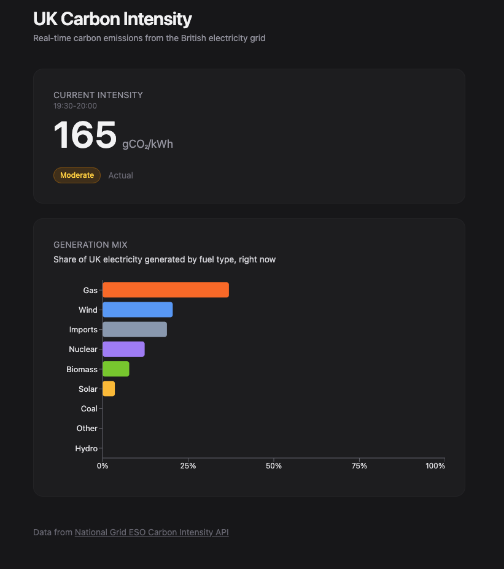

# UK Carbon Intensity Dashboard

A small web dashboard for real-time carbon emissions and generation mix from the British electricity grid.

**Live**: [mya-carbon-dashboard.vercel.app](https://mya-carbon-dashboard.vercel.app/)



## What it shows

- **Current carbon intensity** in gCO₂/kWh, with the National Grid's qualitative index (very low → very high)
- **Generation mix** — the share of UK electricity right now broken down by source: wind, gas, nuclear, solar, biomass, etc.

Data comes from the National Grid ESO's free [Carbon Intensity API](https://carbonintensity.org.uk/).

## Why

A side project to build a small, real-world data dashboard using a modern frontend stack — and to put my chemical engineering interest in decarbonisation to practical use.

## Stack

- **React 18** + **TypeScript** + **Vite**
- **Tailwind CSS v4** for styling
- **Recharts** for the bar chart
- Deployed on **Vercel** with auto-deploy from `main`

## Running locally

```bash
npm install
npm run dev
```

Open [http://localhost:5173](http://localhost:5173).

## What's next

- 24-hour intensity trend chart
- Regional breakdown (select from 14 GB regions)
- "Cleanest hour today" — find the lowest-intensity hour to run high-energy appliances
- Comparison view: today vs the same time last week

## Author

[Mya Ferguson](https://github.com/myaferguson)
